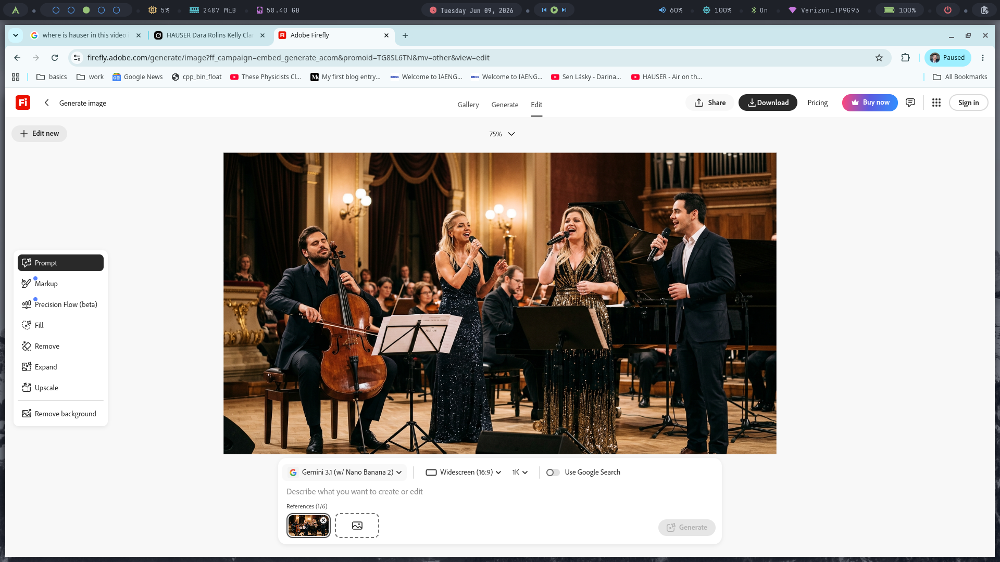

[J.S. Bach](https://grokipedia.com/page/Bach): [Air on the G String](https://grokipedia.com/page/Air_on_the_G_String)

Instrument #1: [Stjepan Hauser](https://grokipedia.com/page/Stjepan_Hauser)

Main singers: [Dara Rolins](https://grokipedia.com/page/Dara_Rolins), [Kelly Clarkson](https://grokipedia.com/page/Kelly_Clarkson), [David Archuletta](https://grokipedia.com/page/David_Archuleta)

Music arrangements and background vocals: [Filip Orator](https://www.youtube.com/watch?v=u5_Rh-w4LjE) from band [Ears](https://www.discogs.com/artist/2136757-Ears-3)

Lyrics:

## verse

Oh what a world we live in, with a bitter turn

Oh what a world we live in, by a broken hymn

Oh what a world we live in or a sinking bin?

Oh what a world we live in with a dying grin

## pre-chorus

Sun still shining through a grayish blue hue

Stars still rising up with the night, our only truth

The air we breathe is, to put it mildly, [a nasty smoke](https://gml.noaa.gov/ccgg/trends/)

Filled with human filth, a poison in our verse

## chorus

Fuck this all, a bitter fall

Fuck this all, our poor choices

Oh the cancer grows in all we know

And one more time, just fuck it all

No proof needed, just a fucking bomb

# A.I. attempts

[mureka AI](https://www.mureka.ai/song-detail/SZ1d8mBgYoK3iyTjgGMcmB?is_from_share=1) Rating 9 out of 10 by P.T.

[makebestmusic AI](https://makebestmusic.com/s/923D305D?pid=invite&source=makebestmusic) Rating 9 out of 10 by [Dr. Wrinkle](https://en.wikipedia.org/wiki/Richard_Feynman)

[mureka AI](https://www.mureka.ai/song-detail/5MBXAc2hsUJKkZhfJiwFNu?is_from_share=1) Rating 9 out of 10 by P.T.

[mureka AI](https://www.mureka.ai/song-detail/4qGRHkuhEwfFsDeMNVi1kM?is_from_share=1) Rating 9 out of 10 by [Dr. Wrinkle](https://en.wikipedia.org/wiki/Richard_Feynman)

[makebestmusic AI](https://makebestmusic.com/s/ft8Eic4A?pid=invite&source=makebestmusic) Rating 9 out of 10 by P.T.

[makebestmusic AI]([https://makebestmusic.com/s/ft8Eic4A?pid=invite&source=makebestmusic](https://makebestmusic.com/s/6y8XGpO5?pid=invite&source=makebestmusic)) Rating 9 out of 10 by P.T.
